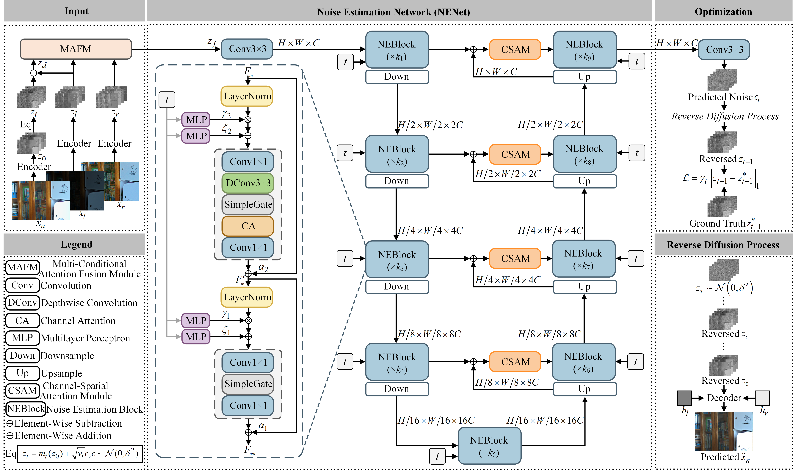

## LatentDark

### LatentDark: Color and Texture-Based Latent Diffusion Model for Low-Light Image Enhancement


### Updates
[**2025.10.16**] Updated code

## Dependenices
* OS: Windows11
* nvidia :
	- cuda: 11.7
	- cudnn: 8.5.0
* python3
* pytorch >= 1.13.0
```
pip install -r requirement.txt
```

## How to use our Code?

Here we provide an example for the **Low-light Image Enhancement (LIE)**, but it can be changed to solve other problems by replacing the dataset.

We retrained the model from scratch using a single Nvidia 3090 GPU.

Note that **we didn't tune any parameter**, the last saved checkpoint was used to evaluation.

## Dataset
### Dataset Preparation
We utilize the LOL-v1 dataset, with 485 images for training and 15 images for testing. Similarly, the LOL-v2-real dataset is used, consisting of 689 images for training and 100 images for testing.

(1) Download LOL-v1 dataset: [LOL-v1](https://daooshee.github.io/BMVC2018website/)

(2) Download LOL-v2 dataset: Wenhan Yang, Haofeng Huang, Wenjing Wang, Shiqi Wang, and Jiaying Liu. "Sparse Gradient Regularized Deep Retinex Network for Robust Low-Light Image Enhancement", TIP, 2021.

### Dataset Directory

Download training and testing datasets and process it in a way such that normal-light images and low-light images are in separately directories, as

```bash
#### training dataset ####

# Retinex Decomposition Network #
./Retinex/lol/data/our485/high
./Retinex/lol/data/our485/low
# Autoencoder #
./unet-latent/datasets/train/gt
./unet-latent/datasets/train/input
./unet-latent/datasets/train/reflectance
# Diffusion Model #
./latent-low/datasets/train/gt
./latent-low/datasets/train/input
./latent-low/datasets/train/reflectance

#### testing dataset ####

# Retinex Decomposition Network #
./Retinex/lol/data/test/high
./Retinex/lol/data/test/low
# Autoencoder #
./unet-latent/datasets/val/gt
./unet-latent/datasets/val/input
./unet-latent/datasets/val/reflectance
# Diffusion Model #
./latent-low/datasets/val/gt
./latent-low/datasets/val/input
./latent-low/datasets/val/reflectance
```
The reflectance image is generated by the Retinex decomposition network. 
Then get into the `codes/config/unet-latent` directory and modify the dataset paths in option files in 
`options/train/train_low.yml` and `options/test/train_latent.yml`.

## Train
The main code for the Retinex decomposition network is located in `codes/config/Retinex/train.py`. 

The main code for the autoencoder is also located in `codes/config/unet-latent/train.py`.

The main code for the diffusion model is also located in `codes/config/latent-low/train.py`.

Then the models and training logs will save in `./log/`. 

## Evaluation
To evaluate our method, please modify the benchmark path and model path.

The main code for the Retinex decomposition network is located in `codes/config/Retinex/predict.py`. 

The main code for the autoencoder is also located in `codes/config/unet-latent/test.py`.

The main code for the diffusion model is also located in `codes/config/latent-low/test.py`.

## The test results of the paper

We also provide the results and pre-trained model. 
[BaiduYun](https://pan.baidu.com/s/1mYINByi8TSN2aMTne8JKJg#list) password:hrz1

### Some Results


## Acknowledgement
Our code is adapted from the original [IR-SDE and Refusion](https://github.com/Algolzw/image-restoration-sde) repository. We thank the authors for sharing their code.

```
@article{hu2025latentdark,
  title={LatentDark: Reflectance guided latent diffusion model for low-light image enhancement},
  author={Hu, Renzhi and Luo, Ting and Jiang, Gangyi and Liu, Leiming and Chen, Yeyao and Xu, Haiyong and He, Zhouyan},
  journal={Signal Processing},
  pages={110125},
  year={2025},
  publisher={Elsevier}
}
```

---
#### --- Thanks for your interest! --- ####
